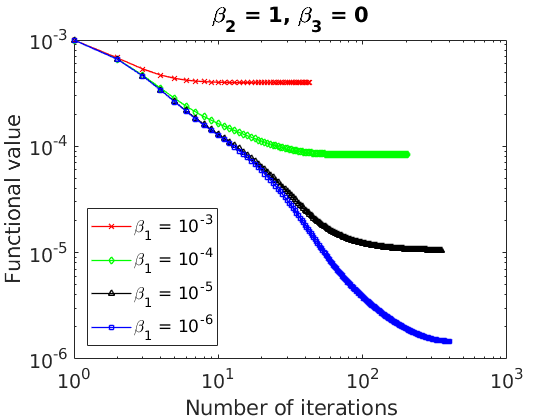
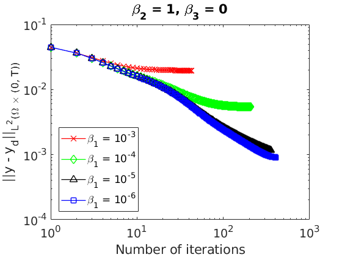
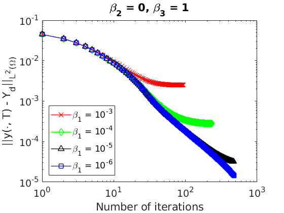

# Interior Control of the Heat Equation with the Steepest Descent Method and OpenFOAM

This is an OpenFOAM solver for the distributed control of the heat equation through the minimization problem

<p align="center">
  
</p>

subject to the state equation

<p align="center">
    
</p>

with  and .

The cost functional gradient is

<p align="center">
    
</p>

where  solves the adjoint problem

<p align="center">
    
</p>

In the steepest descent method the cost gradient is used to update the control as

<p align="center">
    
</p>

with  sufficiently small.

## Getting Started

The solver must be compiled in the terminal. It is advisable to first clean previous compilations with

```
wclean
```

and then use

```
wmake
```

### Prerequisites

OpenFOAM C++ library must be installed in order to compile the code.

The OpenFOAM distribution provided by the [OpenFOAM Foundation](https://openfoam.org/) was used.

## Running a Case

In order to run the solver move to the case folder _heatAdjoinFoamCase_ and type in the command line

```
./Allprepare

heatAdjointFoam
```

* The _heatAdjointFoam_ solver has been tested in a square domain  with zero Dirichlet boundary conditions, , and , , . The target function is .

<p align="center">
  
</p>

<p align="center">
  
</p>

<p align="center">
  
</p>

* The _heatAdjointFoam_ solver has been tested in a square domain  with zero Dirichlet boundary conditions, , and , , . The target function is .

<p align="center">
  
</p>

<p align="center">
  
</p>

<p align="center">
  
</p>

### Warning

It might be needed to use 

```
sed -i -e 's/\r$//' filename
```

and

```
chmod +x filename
```

in order to be able to execute 

```
./filename
```
 
[DyCon Webpage](http://cmc.deusto.eus/dycon/)
